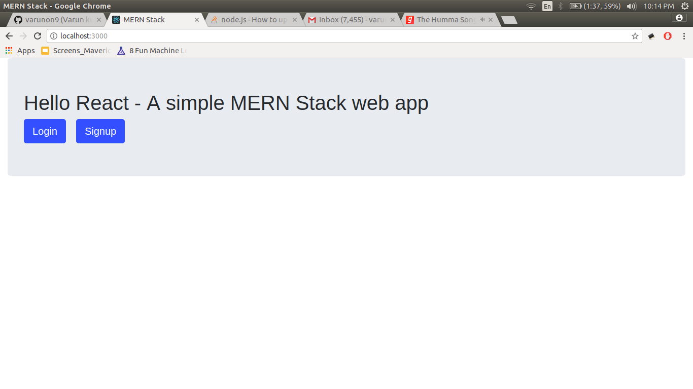
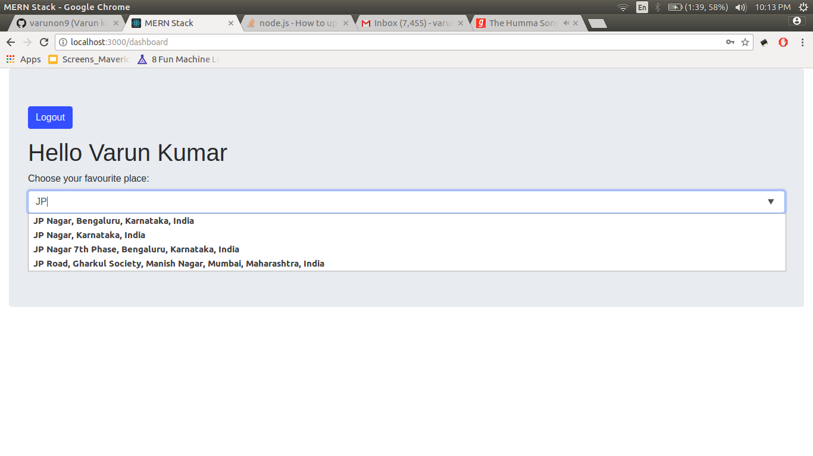
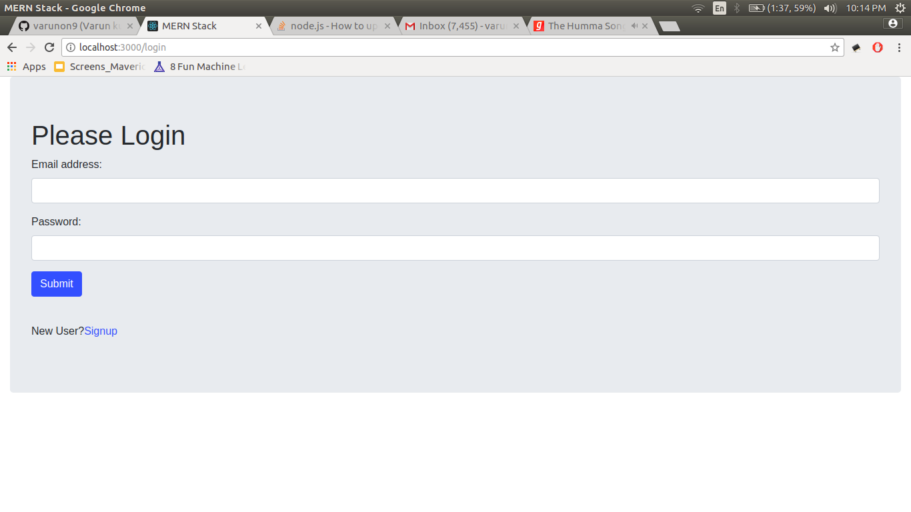
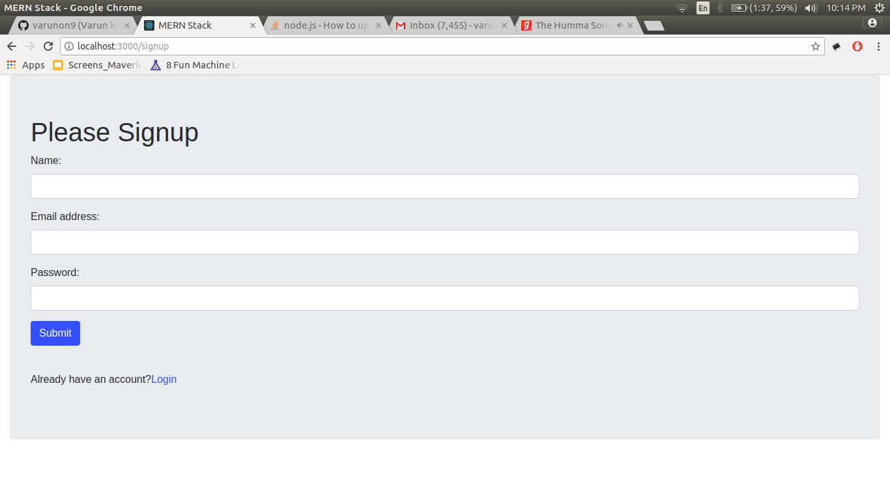
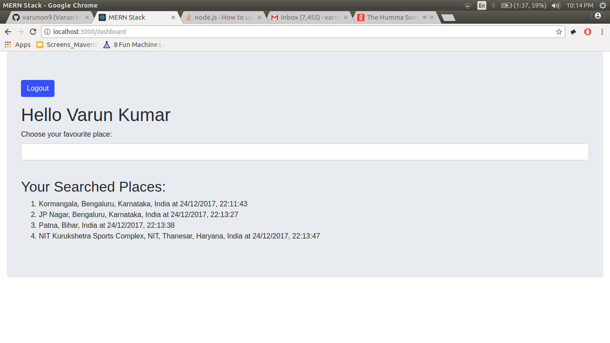

# hello-react
A simple web app based on MERN stack (Mongo, Express, React, NodeJS and Webpack) useful for beginners. 

### Functionalities

1. Login and Signup  
2. Authentication using 'browser localstorage' and 'react-router V4' in front-end as well as jsonwebtoken in backend
3. Upon successful login user can visit Dashboard
4. User can search his favourite places on dashboard and records will be saved (using Google  Place Autocomplete)
5. On refresh of dashboard, all saved places will be displayed

### Using Google Place Autocomplete API

1. Get your Google Place Autocomplete API key (https://developers.google.com/places/web-service/get-api-key)
2. Put this in `../path/hello-react/server/config/config.json` as placeApiKey property
3. Open file `../path/hello-react/server/routes/dashboard.js`
4. Follow instructions written in comments in '/get/placeSuggestions' post route method
5. Even if you don't use Place Autocomplete API, project will work just fine with predefined places suggestions. 

### How to run

1. Open a terminal `Ctrl + Alt + T`
2. Move to desired location `cd Desktop`
3. Clone the repo `git clone https://github.com/varunon9/hello-react.git`
4. Go inside project `cd hello-react/`
5. Install dependencies `npm install`
6. Start mongodb server `sudo service mongod start`
7. Run project using nodemon `nodemon`
8. Visit http://localhost:3000/ in browser

### Screenshots
|  |  |
| --- | --- |
| | |
| | |
| | |

### Other Resources-

1. Getting started with react-native- https://github.com/varunon9/hello-react-native
2. Admin Dashboard developed in react, redux, node.js - https://github.com/varunon9/admin-panel-template-react

#### For query/issues create Github issue or contact: varunon9@gmail.com
